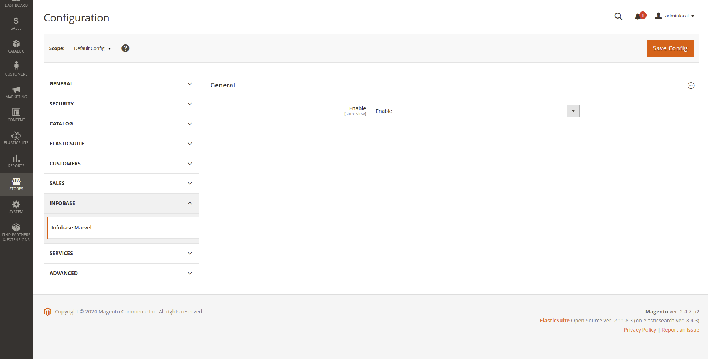
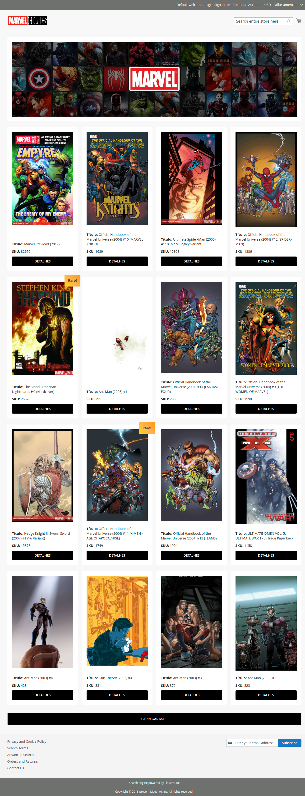

# Desafio Front-End

###### Objetivo: Desenvolver uma página de e-commerce para venda de quadrinhos, representando o lojista Infobase dentro de um Marketplace, utilizando a API da Marvel para listar os produtos.

#### Como Rodar o Projeto
Para rodar o projeto Infobase_MarvelStore, siga os passos abaixo:

##### Pré-Requisitos

- Tenha uma loja Magento 2 versão 2.4.7-p2 instalada e em funcionamento em seu ambiente.
- Certifique-se de que o PHP 8.3 está instalado e configurado no seu servidor.

##### Instalação do Módulo

- Clone ou copie o módulo Infobase_MarvelStore para o diretório app/code/Infobase/MarvelStore da sua instalação Magento.
- No terminal, navegue até a raiz da instalação do Magento e execute os seguintes comandos:

```php bin/magento module:enable Infobase_MarvelStore```

```php bin/magento setup:upgrade```

```php bin/magento cache:clean```

#### Tecnologias Utilizadas
- Magento 2: Plataforma de e-commerce para a construção e gerenciamento da loja online.
- PHP 8.3: Versão do PHP utilizada para garantir a compatibilidade com o Magento 2.4.7-p2.
- API da Marvel: Interface para obter dados dos quadrinhos.
- JavaScript (Knockout.js): Utilizado para manipulação dinâmica da página e interação com a API.
- CSS/LESS: Para estilização e criação de layouts responsivos.
- HTML: Estruturação da página e dos modais.

### Documentação de Desenvolvimento: Infobase_MarvelStore

#### 1. Configuração Inicial
- Instalação de uma loja Magento 2 em sua versão 2.4.7-p2, a partir de uma instalação limpa.
- Versão do php 8.3

#### 2. Criação do Módulo: Infobase_MarvelStore
Estrutura do Módulo:
- O módulo Infobase_MarvelStore foi criado seguindo a arquitetura padrão do Magento 2, localizado em 
 ```app/code/Infobase/MarvelStore```
- Foi criada uma rota personalizada para carregar a página que lista os quadrinhos vendidos pela loja Infobase, obtidos via API da Marvel. 
```/infobase_marvelstore```

#### 3. Integração com a API da Marvel
Chamada à API:
- Implementação de uma chamada à API da Marvel para buscar e exibir quadrinhos, mostrando informações como título, capa e SKU do produto.

#### 4. Modal para Exibição de Detalhes
Criação do Modal:
- Um modal foi desenvolvido para exibir mais detalhes do quadrinho ao clicar no botão "Detalhes".
- A informação adicional exibida no modal inclui , data de publicação e uma breve descrição.

#### 5. Funcionalidade "Carregar Mais"
Um botão "Carregar mais" foi implementado para carregar e exibir mais quadrinhos ao ser clicado, melhorando a navegação e a experiência do usuário.

#### 6. Estilização com CSS/LESS
LESS:
- Toda a página, incluindo a listagem de quadrinhos e o modal de detalhes, foi estilizada com LESS. A responsividade foi ajustada utilizando os breakpoints padrão do Magento 2, garantindo uma boa experiência em dispositivos móveis.

#### 7. Traduções
Traduções via i18n:
- Traduções foram configuradas no arquivo i18n do módulo, seguindo as melhores práticas do Magento 2.

#### 8. Configuração de Módulo
Opção de Habilitar/Desabilitar o Módulo:
- Uma configuração foi adicionada no painel de administração do Magento para permitir habilitar ou desabilitar o módulo Infobase_MarvelStore conforme necessário.

```Stores > Configuration > Infobase > Infobase Marvel > General > Enable```

#### 9. Desenvolvimento do Layout
- Como não havia um layout pré-definido no desafio, o layout da página foi criado por mim, priorizando a usabilidade e a organização visual dos quadrinhos listados, bem como a estrutura do modal de detalhes.

### Abaixo, prints do desafio:






